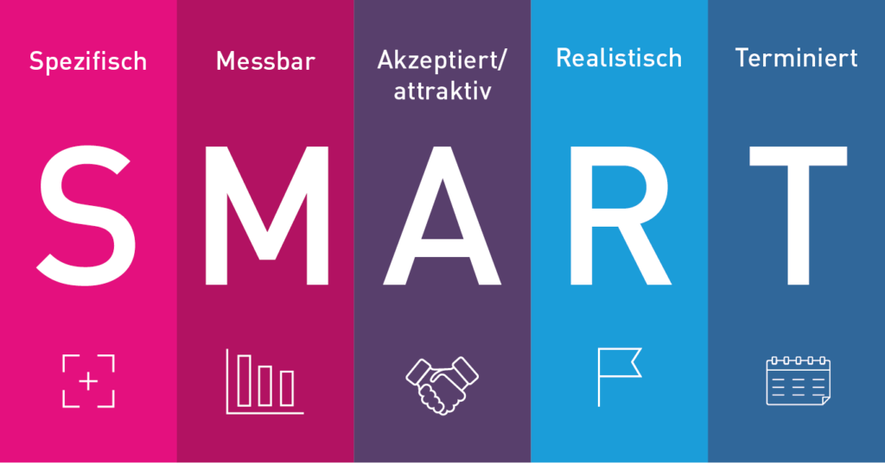

# SMART-Ziele

Smart sind die Kriterien die ein Ziel erfüllen muss

 

Smart Kriterien:
- Spezifisch
- Messbar
- Attraktiv / Akzeptiert
- Realistisch
- Terminiert

Der attraktive terminator Parzifisch ist essbar und elastisch ~ Einfach nicht fragen