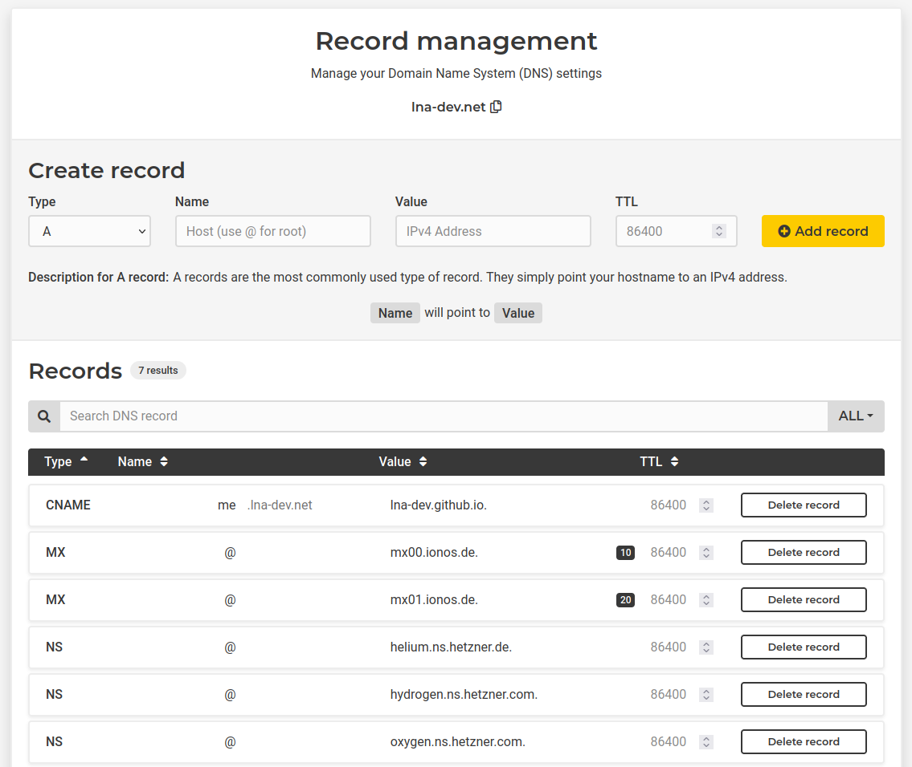

# DNS (Domain Name System)

## Wie funktioniert DNS?

DNS ist einer der wichtigsten Dienste in IP basierten Systemen / Netzwerken. Die Hauptaufgabe ist die Bearbeitung von Anfragen zur Namensauflösung.
DNS steht für Domain Name System.
<br>

## DNS-Server Arten

### DNS-Root-Server

DNS-Root-Server ist ein autoritativer Nameserver für die Root-Zone. Beantwortet Fragen zur Root-Zone oder gibt eine Liste mit autoritativen Nameservern für bestimmte Top-Level-Domains (TLD) zurück.

### Autoritativer Nameserver

Zuständig für eine oder mehrere Zonen. Beantwortet ausschließlich Anfragen für zuständige Zonen. Autoritativ bedeutet, die Informationen des Nameservers gelten als verbindlich.

### Nicht-autoritativer Nameserver

Ist selbst nicht für eine DNS-Zone zuständig und gibt Informationen aus einer rekursiven oder iterativen
DNS-Abfrage weiter.

### Caching-Server-Autoritativ Nameserver

Zwischenspeicher für Informationen zu anderen Nameservern.

### Forwarding-Server

Leitet alle DNS-Anfragen ausnahmslos an andere Nameserver weiter.

### Resolver

Die meisten DNS-Server sind selbst keine autoritativen Server sondern nur Resolver mit Caching oder Forwarding Funktionalität. Resolver befinden sich meist auf dem Computer selbst oder im lokalen Netzwerk.
<br>

## Ablauf der Namensauflösung

<!-- TODO -->

<br>

## DNS-Caching

<!-- TODO -->

<br>

## DNS-Records

- In ASCI kodiert
- Eine Zeile ist ein Eintrag

### Records in der GUI

Viele der Cloud-Provider haben ein kostenloses DNS Angebot für ihre Kunden. Diese verfügen oft über eine grafische Oberfläche.
<br>
<br>
Hier als Beispiel Hetzner:


### Record Arten

| Type  | Beschreibung                                                                                                                                                  |
| ----- | ------------------------------------------------------------------------------------------------------------------------------------------------------------- |
| CNAME | Ein CNAME ist ein Alias für eine andere Domain. Er referenziert auf eine Domain anstatt auf eine IP-Adresse.                                                  |
| MX    | Der Mail-Exchange-Record verweist auf einen Mail-Server.                                                                                                      |
| A     | Einer der simpelsten Record-Types. Er wandelt eine Domain in eine IPv4-Adresse um.                                                                            |
| SOA   | Beinhaltet wichtige Informationen über eine Domain oder Zone. Diese sind aufgrund von Standardisierungen der IETF nötig. (Unter anderem für Domain-Transfers) |
| NS    | Ein Name-Server Eintrag verweist auf weitere DNS-Server welche bei der Auflösung unterstützen.                                                                |
| AAAA  | Ähnlich zu dem A-Record. Der Unterschied ist das AAAA IPv6 Adressen beinhält.                                                                                 |

### Aufbau

```
Name        TTL  Class Type    Value
```

### Beispiel Record

```
de          3600   IN  CNAME   rr.example.net.
```

## Was ist eine DNS-Zone?

<!-- TODO -->

<br>

## Top Level Domains (TLDs)

<!-- TODO -->

<br>

<!--
DNS GUI Beispiel Hetzner
Iterative Rekursive DNS Auflösung
 -->
