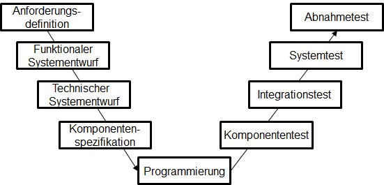

# V-Modell

- Klassisches Projektmanagementmodell
- Ist in Phasen aufgeteilt
- Die Phasen dürfen nicht parallel laufen
- Heist eine Phase muss komplett abgeschlossen sein damit die nächste starten kann
- Links ist der Entwurf
- Recht sind die Tests
- Unten die Ausprogrammierung
- Sehr hohe Testabdeckung da für jede Entwurfsphase eine Testphase existiert
- Beim Entwurf wird wegen der gegenüberliegenden Tests schon an dir realisierbarkeit gedacht

## Links
[Software Engineering Tutorial Deutsch #4 - Das V-Modell](https://www.youtube.com/watch?v=FxS9LFzpM-o)