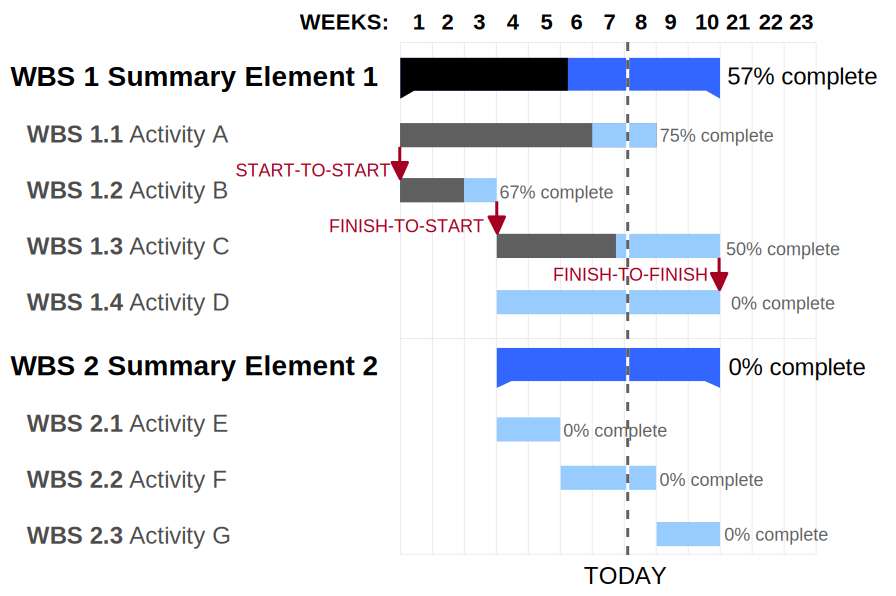

- Ist eine Art mehrdimensionaler Zeitstrahl
- Auf diesem Strahl werden Arbeitspakete mit ihrer Zeitlichen Anordnung und auch mit ihren Abhängigkeiten dargestellt
- Jedes Arbeitspaket hat eine eindeutige Deadline
- Durch diese grafische Veranschaulichung wird erkennbar welche Aufgaben gerade Parallel ablaufen
- Ebenfalls erkennbar ist der Fortschritt des Projektes
- In einem Gantt Diagramm existiert ein kritischer Pfad
- Der kritische Pfad gibt an welche Arbeitspakete dringend abgeschlossen werden müssen bevor die nächsten gestartet werden können
- Das Gantt Diagramm sollte wohl balanciert sein zwischen Übersicht und Detailgrad
- Es neigt dazu bei großen Projekten unübersichtlich zu werden

 

## Links

[GANTT Diagramm erstellen für phänomenales Projektmanagement (einfache Erklärung) 📊🚀](https://www.youtube.com/watch?v=rpUsuZQsiFs)
