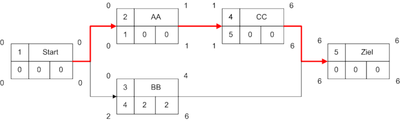

Bei den Prüfungsaufgaben ist meist eine Legende gegeben. Die Anordnung / Namen der einzelnen Felder muss also nicht auswendig gelernt werden. Kommt oft in Prüfungen dran.

[Wikipedia Commons](https://de.wikipedia.org/wiki/Datei:NetzplanBsp.png#file)

 

## Legende

|Abkürzung|Name|
|---------|----|
|FAZ|Frühester Anfangszeitpunkt|
|FEZ|Frühester Endzeitpunkt|
|GP|Gesamtpuffer|
|FP|Freier Puffer|
|SAZ|Spätester Anfangszeitpunkt|
|SEZ|Spätester Endzeitpunkt|

 

## Was ist der freie Puffer?

Der freie Puffer ist der Zeitraum, um den ein Vorgang maximal verschoben werden kann, ohne den frühesten Termine seiner nachfolgenden Vorgänge zu beeinflussen.

 

## Was ist der Gesamtpuffer?

Der Gesamtpuffer ist der Zeitraum, um den ein Vorgang maximal verschoben werden kann, ohne die spätesten Termine seiner nachfolgenden Vorgänge zu beeinflussen.

 

## Was ist der kritische Pfad?

Der kritische Pfad ist der Weg vom ersten bis zum letzten Vorgang eines Netzplans, auf dem die Pufferzeiten minimal sind.

 

## Links

[Was ist ein Netzplan?](https://www.inloox.de/projektmanagement-glossar/netzplan/)  
[Netzplantechnik einfach erklärt + Beispiel mit kritischem Pfad!](https://www.youtube.com/watch?v=OfrfVY-eYQY)
