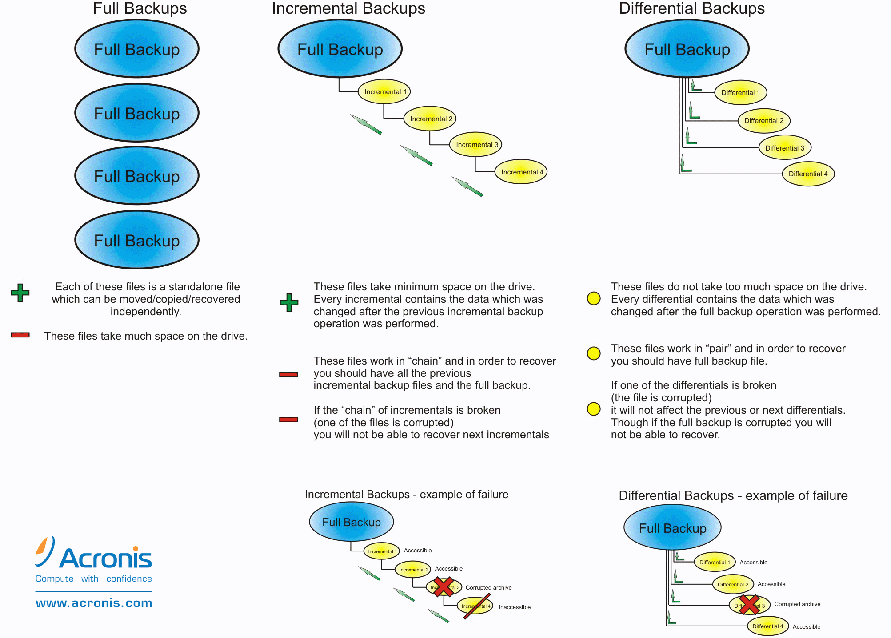

## Vollbackup

- Ein komplettes Backup eines Laufwerks, einer Partition, eines Verzeichnisses oder eines festgelegten Datenbereichs.
- Die Informationen der Auswahl werden bei einem Vollbackup vollständig kopiert und aufeinem anderen Medium oder in einem anderen (Speicher)-Bereich abgelegt.
- Das Archivbit wird beim Vollbackup zurückgesetzt.

| Vorteile                     | Nachteile                                                           |
|:------------------------------:|:---------------------------------------------------------------------:|
| + **Dauer der Wiederherstellung:** schnellste und einfachste Backup-Art in der Wiederherstellung | - **Speicherplatzverbrauch:** Speichern von Duplikaten verbraucht viel Speicherplatz |
|                              | - **Dauer des Backups:** Sicherung dauert am längsten von allen Backup-Arten          |

## Differenzielles Backup

- Ein Backupverfahren, bei der nach einem ersten Vollbackup ausschließlich die Dateien oder
Informationen gesichert werden, die sich von diesem Vollbackup unterscheiden.
- Dieses Backupverfahren benötigt im Vergleich zum Vollbackup oder dem Klonen wenig Speicherplatz. Die differenziellen Backups bauen nicht aufeinander auf.
- Das Archivbit wird beim differenziellen Backup nicht verändert.

| Vorteile                     | Nachteile                                                           |
|:------------------------------:|:---------------------------------------------------------------------:|
| + **Dauer der Wiederherstellung:** schneller als das inkrementelle Backup | - **Gegenüber Vollbackup:** langsamer in Wiederherstellung |
| + **Dauer des Backups:** schneller als das Vollbackup                             | - **Gegenüber inkrementelles Backup:** langsamer im Sicherungsvorgang          |
| + **Speicherplatzverbrauch:** weniger als das Vollbackup                            |                                                                     |

## Inkrementelles Backup

- Nach einem ersten Vollbackup werden ausschließlich die Dateien oder Informationen gesichert, die sich seit den vorangegangenen inkrementellen Backups verändert haben oder neu hinzugekommen sind.
- Im Vergleich zu anderen Backupverfahren wird weniger Speicherplatz benötigt. Das Backup wird schneller ausgeführt.
- Das Archivbit wird beim inkrementellen Backup zurückgesetzt.

| Vorteile                     | Nachteile                                                           |
|:------------------------------:|:---------------------------------------------------------------------:|
| + **Dauer des Backups:** Sicherungsvorgang nimmt von allen am wenigsten Zeit in Anspruch | - **Dauer der Wiederherstellung:** aufwendigste Backup-Art in der Wiederherstellung |
| + **Speicherplatzverbrauch:** pro Backup wird am wenigsten Speicherplatz beansprucht                            |           |

1

## Klonen

- Es wird eine 1-zu-1-Kopie in einer Datenträger-Abbild-Datei, dem sogenannten Image, erstellt. Diese enthält alle wichtigen Informationen des ursprünglichen Mediums, einschließlich des Dateisystems und der Benutzereinstellungen.
- Das Abbild entspricht der Datenmenge des ursprünglichen Datenträgers.
- Das Archivbit wird beim Klonen nicht verändert.

## Generationenprinzip / Großvater-Vater-Sohn-Prinzip
Ziel dieses Prinzips ist es, eine **lückenlose Datensicherung so effizient wie möglich durchzuführen.**

2 Zu Beginn einer Datensicherung wird ein Vollbackup erstellt und im Anschluss daran **tägliche Backups** – die sogenannten **"Sohn-Backups"**. Die Sohn-Backups können entweder als differenzielles oder inkrementelles Backup erfolgen. **Am Ende der Woche** wird ein vollständiges Backup, das **"Vater Backup"**, durchgeführt. Da dieses auch alle täglichen Sicherungen der Woche enthält, werden alle vorangegangenen Backups (Sohn-Backups) gelöscht. **Nach vier Wochen** haben sich vier einzelne wöchentliche Vater-Backups angesammelt, die dann durch das **"Großvater-Backup"** aufgehoben werden.

- **Tägliche Sicherung:**	Sohn-Backup z.B. inkrementelles oder differenzielles Backup
- **Wöchentliche Sicherung:**	Vater-Backup ersetzt Sohn-Backup durch vollständiges Backup am Ende einer Woche
- **Monatliche Sicherung:** Großvater-Backup ersetzt Vater-Backup durch vollständiges Backup am Ende eines Monats

## Erklärungsvideo 📹



### Quellen

- 1 [What Is The Default Acronis Backup Cloud Backup Scheme Format](https://support.exabytes.sg/en/support/solutions/articles/14000058909-what-is-the-default-acronis-backup-cloud-backup-scheme-format)
- 2 [Backup Arten und Methode: Wie Sie Ihre Daten sichern sollten!](https://www.keyweb.de/de/keyweb/mehr-erfahren/blog/it-sicherheit-und-datenschutz/backup-arten-und-methoden)