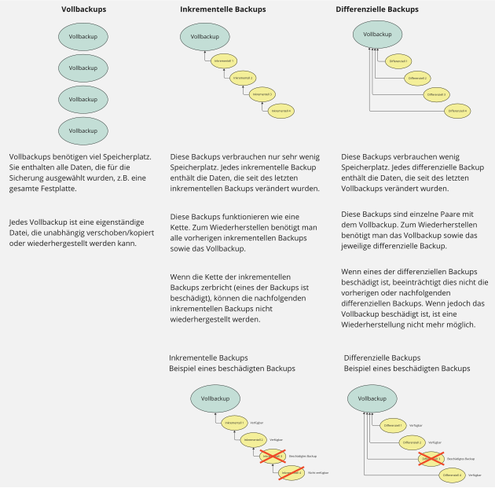

## Vollbackup

- Ein komplettes Backup eines Laufwerks, einer Partition, eines Verzeichnisses oder eines festgelegten Datenbereichs.
- Die Informationen der Auswahl werden bei einem Vollbackup vollständig kopiert und auf einem anderen Medium oder in einem anderen (Speicher)-Bereich abgelegt.
- Das Archivbit wird beim Vollbackup zurückgesetzt.

|                                             Vorteile                                             |                                      Nachteile                                       |
| :----------------------------------------------------------------------------------------------: | :----------------------------------------------------------------------------------: |
| + **Dauer der Wiederherstellung:** schnellste und einfachste Backup-Art in der Wiederherstellung | - **Speicherplatzverbrauch:** Speichern von Duplikaten verbraucht viel Speicherplatz |
|                                                                                                  |     - **Dauer des Backups:** Sicherung dauert am längsten von allen Backup-Arten     |

## Differenzielles Backup

- Ein Backupverfahren, bei der nach einem ersten Vollbackup ausschließlich die Dateien oder
  Informationen gesichert werden, die sich von diesem Vollbackup unterscheiden.
- Dieses Backupverfahren benötigt im Vergleich zum Vollbackup oder dem Klonen wenig Speicherplatz. Die differenziellen Backups bauen nicht aufeinander auf.
- Das Archivbit wird beim differenziellen Backup nicht verändert.

|                                 Vorteile                                  |                               Nachteile                               |
| :-----------------------------------------------------------------------: | :-------------------------------------------------------------------: |
| + **Dauer der Wiederherstellung:** schneller als das inkrementelle Backup |      - **Gegenüber Vollbackup:** langsamer in Wiederherstellung       |
|           + **Dauer des Backups:** schneller als das Vollbackup           | - **Gegenüber inkrementelles Backup:** langsamer im Sicherungsvorgang |
|         + **Speicherplatzverbrauch:** weniger als das Vollbackup          |                                                                       |

## Inkrementelles Backup

- Nach einem ersten Vollbackup werden ausschließlich die Dateien oder Informationen gesichert, die sich seit den vorangegangenen inkrementellen Backups verändert haben oder neu hinzugekommen sind.
- Im Vergleich zu anderen Backupverfahren wird weniger Speicherplatz benötigt. Das Backup wird schneller ausgeführt.
- Das Archivbit wird beim inkrementellen Backup zurückgesetzt.

|                                         Vorteile                                         |                                      Nachteile                                      |
| :--------------------------------------------------------------------------------------: | :---------------------------------------------------------------------------------: |
| + **Dauer des Backups:** Sicherungsvorgang nimmt von allen am wenigsten Zeit in Anspruch | - **Dauer der Wiederherstellung:** aufwendigste Backup-Art in der Wiederherstellung |
|   + **Speicherplatzverbrauch:** pro Backup wird am wenigsten Speicherplatz beansprucht   |                                                                                     |

## Übersicht der drei Backuparten

## Klonen

- Es wird eine 1-zu-1-Kopie in einer Datenträger-Abbild-Datei, dem sogenannten Image, erstellt. Diese enthält alle wichtigen Informationen des ursprünglichen Mediums, einschließlich des Dateisystems und der Benutzereinstellungen.
- Das Abbild entspricht der Datenmenge des ursprünglichen Datenträgers.
- Das Archivbit wird beim Klonen nicht verändert.

## Generationenprinzip (Großvater-Vater-Sohn-Prinzip)

Dieses Prinzip sorgt für eine **effiziente und nahezu lückenlose Datensicherung**.

### So funktioniert es:

1. **Vollbackup zu Beginn:** Zunächst wird eine vollständige Datensicherung durchgeführt.
2. **Tägliche Sicherung (Sohn-Backup):** Jeden Tag wird ein Backup erstellt – entweder als **inkrementelles** oder **differenzielles** Backup.
3. **Wöchentliche Sicherung (Vater-Backup):** Am Ende jeder Woche wird ein **vollständiges Backup** gemacht. Dieses ersetzt die täglichen Sicherungen der Woche, die dann gelöscht werden.
4. **Monatliche Sicherung (Großvater-Backup):** Nach vier Wochen gibt es vier wöchentliche Vater-Backups. Diese werden durch ein neues **Vollbackup (Großvater-Backup)** ersetzt.

### Zusammenfassung:

- **Täglich:** Sohn-Backup (inkrementell oder differenziell)
- **Wöchentlich:** Vater-Backup ersetzt die täglichen Backups durch ein Vollbackup
- **Monatlich:** Großvater-Backup ersetzt die wöchentlichen Backups durch ein neues Vollbackup

Dieses System spart Speicherplatz und stellt sicher, dass alle wichtigen Daten regelmäßig gesichert werden.

## Erklärungsvideo 📹


