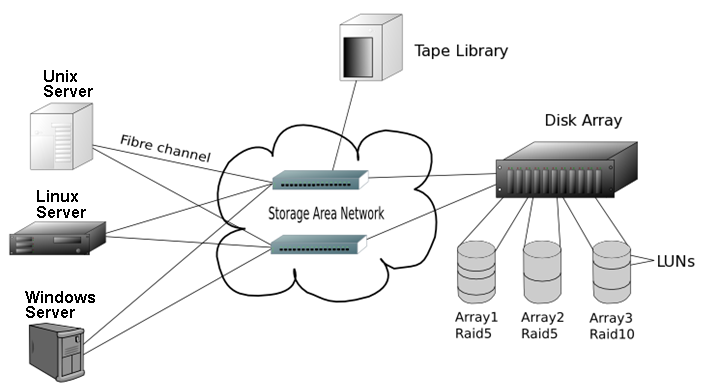
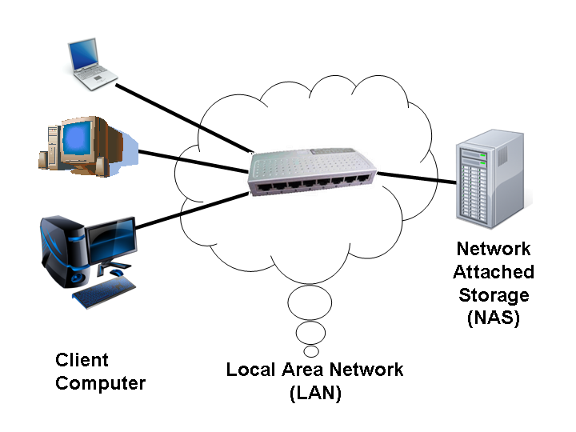

Als erstes sollte der Unterschied zwischen einem Blockgerät und einem Dateisystem definiert werden.

## Block-Gerät

Ein **Block-Gerät** ist ein Handle für RAW-Festplatten.  

### Beispiel Block-Gerät

Wie `/dev/sda` für eine Festplatte oder `/dev/sda1` für eine Partition auf dieser Festplatte.

## Dateisystem

Ein **Dateisystem** befindet sich auf dem Blockgerät, um Daten zu speichern. Sie können dies dann einbinden.  

### Beispiel Dateisystem

Wie `mount/dev/sda1/mnt/somepath`

## SAN - Storage Area Network

**SAN** ist ein Blockgerät, das über das Netzwerk bereitgestellt wird.

- Wie DAS müssen Sie noch ein Dateisystem darauf ablegen, bevor Sie es verwenden können.
- Zu diesen Technologien gehören FibreChannel, iSCSI, usw.

  
[Wikipedia Commons](https://commons.wikimedia.org/wiki/File:Schema_SAN_german_V2.png)  

## NAS - Network Attached Storage

**NAS** ist ein Dateisystem, das über das Netzwerk bereitgestellt wird.

- Kann direkt eingebunden (ge-mount-et) und verwendet werden.
   Zu diesen Technologien gehören NFS, CIFS, AFS, SMB, usw.

  
[Wikipedia Commons](https://commons.wikimedia.org/wiki/File:NAS.png)  

## DAS - Direct Attached Storage

**DAS** ist ein Blockgerät von einer Platte, die physisch (direkt) an den Host-Computer angeschlossen ist.

- Sie müssen ein Dateisystem darauf ablegen, bevor Sie es verwenden können.
- Zu diesen Topologien gehören IDE, SCSI, SATA, SAS, usw.

## Links 🔗

[Wikipedia SAN](https://de.wikipedia.org/wiki/Storage_Area_Network)  
[Wikipedia DAS](https://de.wikipedia.org/wiki/Direct_Attached_Storage)  
[Wikipedia NAS](https://de.wikipedia.org/wiki/Network_Attached_Storage)  
