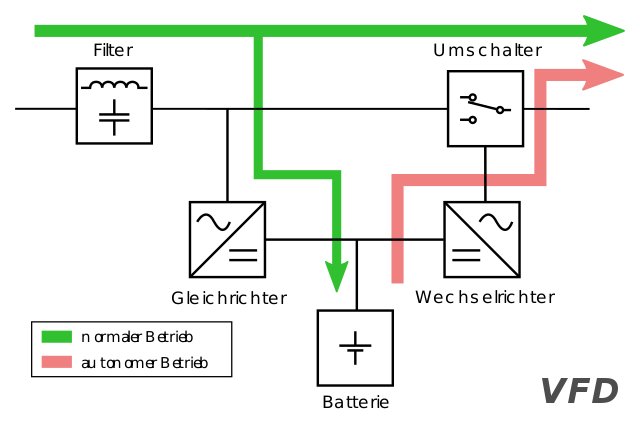
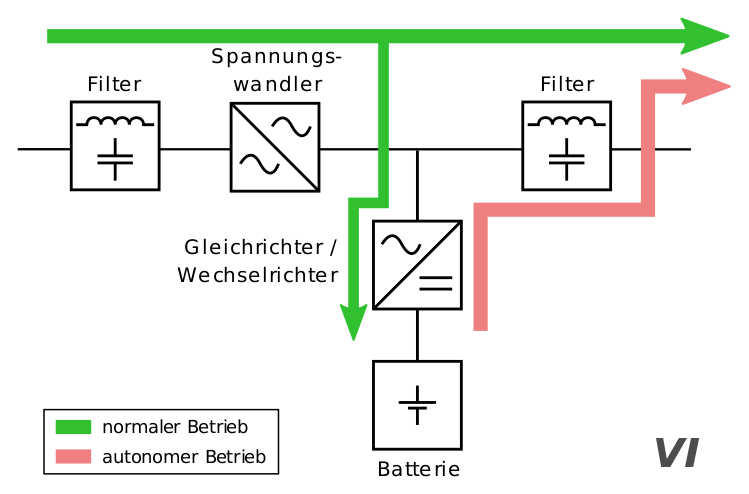
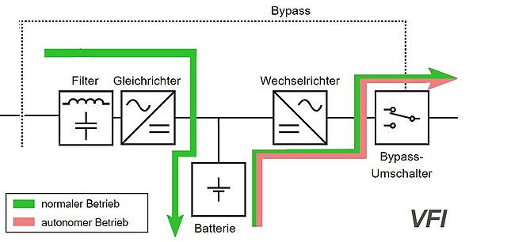

## Allgemein

Eine USV ist ein Stromversorgungssystem mit Energiespeicher, das bei einem Ausfall der Stromzufuhr eine Versorgung sicherstellt.
Es gibt generell drei Arten von USV's

- **VFD** (Voltage Frequency Dependent from Mains Supply)
  - Standby- oder Offline-USV genannt
- **VI** (Voltage Independent from Mains Supply)
  - Line Interactive-USV oder Netzinteraktive USV genannt
- **VFI** (Voltage and Frequency Independent from Mains Supply)
  - Online-USV genannt

## Beschreibung

### Offline-USV (VFD)

Bei der Verwendung dieser Bauart wird im Normalbetrieb der Strom direkt vom Netz an die angeschlossenen Geräte weitergeleitet. Sollte die Netzversorgung abbrechen, so schaltet die USV auf Akkubetrieb um.

  
[Wikipedia Commons](https://upload.wikimedia.org/wikipedia/commons/3/3b/UPS_VFD_-_Offline_UPS_%28German%29.svg)

#### Vor- und Nachteile

| Vorteile                              | Nachteile                    |
| ------------------------------------- | ---------------------------- |
| Sehr gutes Preis-Leistungs-Verhältnis | Verzerrtes Signal            |
| Keine Belüftung notwendig             | Schwankungen bei Lastwechsel |
| Hohe Lebenserwartung der Batterie     | Hohe Umschaltzeiten          |

#### Anwendungsbereich

- Einzelne Computer
- Peripheriegeräte

---

### Line-Interactive-USV (VI)

Bei dieser USV handelt es sich um eine verbesserte Variante der Offline-USV.
Eine Line-Interactive-USV verfügt über ein System, welches stets dafür sorgt, dass die Ein- und Ausgangsspannungen gemessen werden, sowie der Akku konstant über einen Gleichrichter geladen wird. Im Bedarfsfall kann sie somit schneller zugeschaltet werden.

  
[Wikipedia Commons](https://upload.wikimedia.org/wikipedia/commons/8/83/VFI_UPS_-_Online_UPS_%28German%29.svg)

#### Vor- und Nachteile

| Vorteile                         | Nachteile                                                   |
| -------------------------------- | ----------------------------------------------------------- |
| Gutes Preis-Leistungs-Verhältnis | Filter notwendig                                            |
| Kurze Schaltzeiten               | ZusätzlicherTransformator für Spitzenausgleich erforderlich |
|                                  | Hohe Umschaltzeiten                                         |

#### Anwendungsbereich

- Computer
- Kleine Server-System
- Netzwerke / Telekommunikationsanlagen

---

### Online-USV (VFI)

Bei der Online-USV wird im Normalbetrieb als auch im Falle eines Netzausfalles die angeschlossenen Geräte über einen Wechselrichter versorgt, während ein Gleichrichter im Normalfall sowohl den Wechselrichter als auch die Akkus versorgt.
Fällt die Netzversorgung aus, wird sofort, ohne jede Verzögerung, der Wechselrichter von den Akkus versorgt. Für Servicezwecke verfügen Online-USV's über eine Bypass-Schaltung. Mit dieser Schaltung können angeschlossene Geräte entkoppelt werden, damit die USV abgeschaltet werden kann.

  
[Wikipedia Commons](https://upload.wikimedia.org/wikipedia/commons/8/83/VFI_UPS_-_Online_UPS_%28German%29.svg)

#### Vor- und Nachteile

| Vorteile                                  | Nachteile                       |
| ----------------------------------------- | ------------------------------- |
| Wahre unterbrechungsfreie Stromversorgung | Lüftung benötigt                |
| Keine Schaltzeit                          | Relativ hoher Anschaffungspreis |
| Spannung und Frequenz sind absolut stabil |                                 |

#### Anwendungsbereich

- Sensible Netzwerkserver
- Umgebungen mit häufigen Störungen im Versorgungsnetz

## Haltedauer einer USV

Um die Haltedauer einer USV berechnen zu können, müssen wir ein paar Begriffe klären.

### Wirkleistung

- Als **Wirkleistung** wird der **reale** Stromverbrauch, der angeschlossenen Geräte, bezeichnet. Gemessen in **Watt (W)**.

### Scheinleistung

- Als **Scheinleistung** wird die Summe von **Wirkleistung** und **Blindleistung** bezeichnet.
  **Blindleistung** ist jene die zwischen Erzeuger und Verbraucher übertragen wird.
  **Scheinleistung** wird in **Voltampere (VA = Volt \* Ampere)** gemessen.

### Autonomiezeit

- Die **Autonomiezeit** drück aus wie lange die angeschlossenen Geräte bei einem Netzausfall uneingeschränkt weiter benutzt werden können.

### Kleine Beispielaufgabe

- Bestimmen Sie die zu erwartende Haltedauer einer USV, die aus 2 Batterien mit je 300VAh besteht, unter der Voraussetzung, dass eine Wirkleistung von 700W benötigt wird. Berücksichtigen Sie die 10%ige Reserve.

```txt
W = 2 * 300VAh , P = 700W
Scheinleistung = 700W / 0,6 = 1166,66
t = W / S = 600VAh / 1166,66 = 0,51h = 30 Minuten
30 Minuten * 90% = 27 Minuten
```

---

## Links 🔗

[Wikipedia Unterbrechungsfreie Stromversorgung](https://de.wikipedia.org/wiki/Unterbrechungsfreie_Stromversorgung)  
