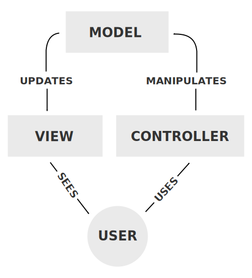

### Komponenten

Außer das Aufteilen einer App in die folgenden Komponenten definiert dies Pattern auch die Kommunikation zwischen den einzelnen Teilen.

- Modell: Verantwortlich für das Management der Daten der App. Bekommt den User-Input vom Controller.
- View: Rendert die Präsentation der Anwendung in welcher Form das auch immer sein muss
- Controller: Reagiert auf den Input von Usern und interagiert mit dem Modell. Er empfängt Input validiert ihn gegebenenfalls und gibt ihn dann an das Modell weiter.

#### Modell

Das Modell ist die Zentrale Komponente des Patterns. Es ist die unter Umständen dynamische Datenstruktur der App. Es ist unabhängig vom User-Interface.

#### View 🌄

Die View beinhaltet alle möglichen Arten der Präsentation der Daten. Es sind auch mehrere Views für die selben Daten möglich. Dies kann nützlich sein wenn eine Information für verschiedene Personengruppen dargestellt werden soll.  
  
Zum Beispiel: Diagramme, Tabellen

#### Controller 🎮

Der Controller verarbeitet Input und wendet diesen anhand von Befehlen an Model oder View an.

## Links

[Wikipedia](https://en.wikipedia.org/wiki/Model%E2%80%93view%E2%80%93controller)  
[FreeCodeCamp](https://www.freecodecamp.org/news/the-model-view-controller-pattern-mvc-architecture-and-frameworks-explained/)  
