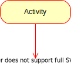
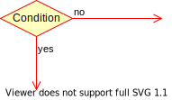

- Auch Flussdiagramm genannt

## Elements

| Name      | Darstellung                                          |
| --------- | ---------------------------------------------------- |
| Start     |          |
| End       |              |
| Activity  |    |
| Condition |  |

## Erklärungsvideos Aktivitätsdiagramm 📹

### Basics



### Swimlanes und Nebenläufigkeit



## Links 🔗

[IONOS Aktivitätsdiagramm](https://www.ionos.de/digitalguide/websites/web-entwicklung/uml-aktivitaetsdiagramme/)
