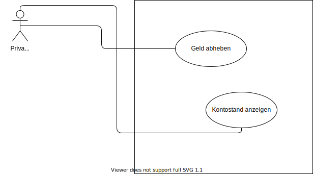

Zu UML werden in der Prüfung oft Cheatsheets beigelegt. Übung mithilfe dieser Cheatsheets die Diagramme in kurzer Zeit zu erstellen sollte für die Prüfung vorhanden sein.

## Klassendiagramm

### Zugriffsmodifikatoren

| Zeichen | Sichtbarkeit |
| ------- | ------------ |
| +       | Public       |
| -       | Private      |
| #       | Protected    |
| ~       | Package      |

### Vererbung

### Assoziation

### Komposition

- Noch stärkere Bindung als Aggregation
- Eine Teil-Klasse kann nicht ohne eine andere Klasse existieren

### Aggregation

- Klassen besitzen starke Beziehung
- Existenzen der einzelnen Klassen ist nicht aneinander gebunden
- Zeigt eine "Art" Besitz an

### Multiplizitäten

| Multiplizität | Alternative Schreibweise | Beschreibung                  |
| ------------- | ------------------------ | ----------------------------- |
| 0...1         |                          | Keiner oder Einer             |
| 1             |                          | Genau Einer                   |
| 0...\*        | \*                       | Null oder beliebig viele      |
| 1...\*        |                          | Beliebig viele - Mindestens 1 |

 

### Erklärungsvideo Klassendiagramm 📹



## Anwendungsdiagramm / Anwendungsfalldiagramm / Use-Case-Diagramm

- Keine Abläufe
- Funktionalität der Software aus einer Sicht des Anwenders
- Unabhängig von technischer Realisierung
- Komplexes System einfach darstellen => Hohes Abstraktionsniveau

 

### Vorgehen beim Erstellen

- Ermittle die Akteure
- Ermittle die Standard Use-Cases
- Ermittle Sonderfall-Use-Cases
- Komplexe Use-Cases aufteilen

### Assoziation

### Include-Beziehung

Durch die Include Beziehung kann ein Use-Case einen anderen Use-Case importieren. Besser gesagt der Use-Case importiert das Verhalten des anderen Use-Cases.

⚠️ Verhalten wird immer importiert ⚠️

 

### Vererbung

Bei der Vererbung werden die Eigenschaften eines Use-Cases oder eines Akteurs an ein weiteres Element übergeben / vererbt.

### Extend-Beziehung

- **Optionale** Erweiterung eines Use-Cases
- Abhängig von einer Bedingung

### Erklärungsvideo Use-Case-Diagramm 📹



## Sequenzdiagramm

Ein Sequenzdiagramm beschreibt Abläufe. Es zeigt die Interaktionen von Objekten in einer grafischen Zeitlinie.

### Erklärungsvideo Sequenzdiagramm 📹



## Aktivitätsdiagramm / Flussdiagramm

<!-- TODO -->

### Erklärungsvideo Aktivitätsdiagramm 📹



<!-- ## Zustandsdiagramm

TODO -->

## Links 🔗

[Programmieren Starten](https://www.youtube.com/playlist?list=PL_pqkvxZ6ho05rbgNaakWmxFmT9qEXzIo)  
[IONOS Aktivitätsdiagramm](https://www.ionos.de/digitalguide/websites/web-entwicklung/uml-aktivitaetsdiagramme/)  
