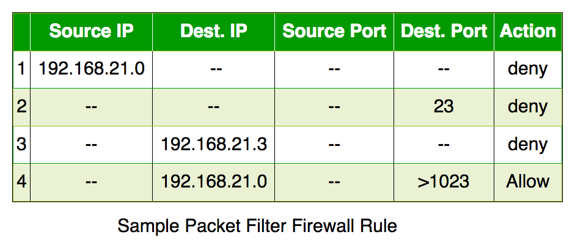
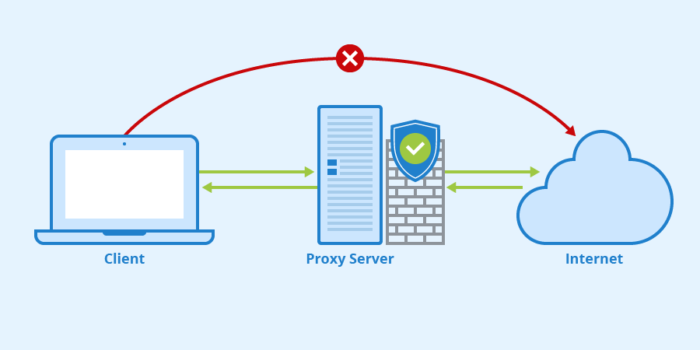
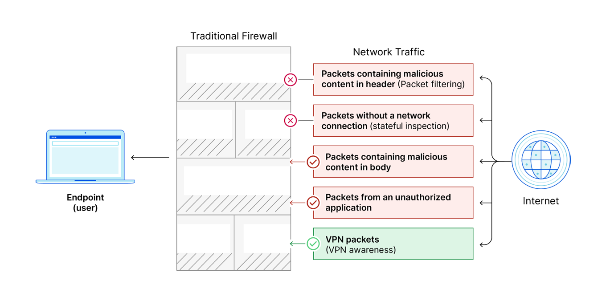

### Paketfilter-Firewall
Prüft einzelne Datenpakete nach: Absender (Quelladresse), Empfänger (Zieladresse) und Portnummer (Quell-/Zieladresse).

Die Paketfilter-Firewall ist in der Regel **stateless**, das bedeutet, dass sie keine Informationen über den Verbindungszustand speichert. 

✅ **Vorteile**:
- Schnell und effizient, da nur Header-Informationen geprüft werden
- Geringer Ressourcenverbrauch
- Einfach zu konfigurieren

❌**Nachteile**: 
- Keine tiefere Analyse des Datenverkehrs
- Keine Prüfung/ berücksichtigung des Verbindungszustands (bei stateless) 

### Stateful Inspection (Stateful-Firewall)
Merkt sich aktive Verbindungen auf einer **Verbindungstabelle** und erlaubt nur legitime Antworten. 

Diese Firewalls verfolgen also den Status von Verbindungen (z.B. TCP Sessions) und treffen dann basierend auf dem Verbindungszustand Entscheidungen. 
Sie bieten eine **höhere Sicherheit** als **Paketfilter-Firewalls**, da sie den Kontext der Kommunikation berücksichtigen.  

✅**Vorteile**: 
- Speichert den Status aktiver Verbindungen -> sicherer als reine Paketfilter
- Erkennt legitime Antworten und blockiert unerwarteten Datenverkehr

❌**Nachteile**: 
- Höherer Ressourcenverbrauch als reine Paketfilter
- Kann durch gezielte Angriffe auf Verbindungstabelle überlastet werden
- Keine detaillierte Inhaltsprüfung
### Proxy-Firewall
Agiert als Vermittler zwischen Client und Server. Verbirgt interne Netze und prüft Inhalte genau. 

Bei dieser Variante agiert die Firewall als **Vermittler (Proxy)** zwischen dem internen und externen Netz. Sie kann auf der Anwendungsebene (Layer 7) filtern, indem sie z.B. HTTPS- oder FTP-Daten genauer untersucht. 

✅**Vorteile**:
- Sehr sicher, da direkte Verbindung zwischen Client und Server verhindert werden
- Kann Inhalte genau analysieren
- Verbirgt interne Netzwerke (IP-Adressen sind nicht sichtbar) 

❌**Nachteile**:
- Langsamer als Paketfilter oder Stateful Firewalls 
- Nicht alle Anwendungen unterstützen Proxy-Verbindungen
- Komplexere Einrichtung und Wartung
### Next-Generation Firewall (NGFW) 
Sind moderne Firewalls mit **zusätzlichen Funktionen** wie:
- [Intrusion Detection und Prevention Systems (IDS/IPS)](https://www.juniper.net/de/de/research-topics/what-is-ids-ips.html/ "Intrusion Detection und Prevention Systems (IDS/IPS) auf juniper.net")
- [Deep Packet Inspection (DPI)](https://de.wikipedia.org/wiki/Deep_Packet_Inspection/ "DPI auf Wikipedia")
- Stateful Inspection
- VPN Awareness (Kann VPN-Traffic erkennen und z.B. durchlassen)  
- uvm. 

Diese Firewalls kombinieren also traditionelle Firewall-Funktionen mit zusätzlichen Sicherheitsfunktionen.
Sie können bedrohungsspezifische Muster erkennen und bieten oft umfangreiche Management- und Reporting Funktionen, dafür sind sie aber auch entsprechend teuer und eher für große Unternehmen geeignet. 

✅**Vorteile**:
- Kombination aus Paketfilter, Stateful Inspection Firewall
- Erkennt und blockiert Bedrohungen 
- Ermöglicht Anwendungsfilterung
- Viele weitere (Je nach Features) 

❌**Nachteile**:
- Sehr teuer in Anschaffung und Wartung
- Hoher Ressourcenverbrauch
- Komplexe Konfiguration erfordert Fachwissen

### Software-/ und Hardwarefirewall 
Zusätzlich zu den oben genannten Typen kann auch die Unterscheidung zwischen softwarebasierten Firewalls und hardwarebasierten Firewalls relevant für die Prüfung sein. 

#### Software-Firewalls
laufen auf einem Client (z.B. dein PC) und schützt dein einzelnes Gerät.   

✅**Vorteile**:
- Günstig, oft in OS integriert
- Individuelle Regeln pro Gerät möglich

❌**Nachteile**:
- Muss auf jedem Gerät eingerichtet werden
- Weniger sicher als eine zentrale Firewall
- Hoher Wartungsaufwand bei vielen Geräten

#### Hardware-Firewalls
sind ein eigenständiges Gerät, schneller und sicherer für große Netzwerke.  

✅**Vorteile**:
- Schutz für das gesamte Netzwerke
- Eigenständiges System
- Leistungsstärker und sicherer als Software-Lösungen

❌**Nachteile**:
- Teurer als Software-Firewalls
- Komplexer in der Konfiguration 

### Firewall-Prüfungsaufgaben
- Eine gängige Prüfungsaufgabe ist das erstellen oder ergänzen einer Firewall-Regeltabelle mit Quell-IP, Ziel-IP, Protokoll und Port (*Siehe Bild Paketfilter-Firewall*)
- Auch beliebt ist ein Szenario wie folgendes: "Ein externer Angreifer versucht, über Port 22 auf den Webserver zuzugreifen. Wird die Firewall dies zulassen? Begründen Sie Ihre Antwort."
- Aber auch Fragen wie: "Welche Firewall-Art wäre für dieses Szenario am besten geeignet: Paketfilter-Firewall, Stateful Firewall oder Next-Generation Firewall? Begründen Sie Ihre Wahl." können selbstverständlich gestellt werden. 